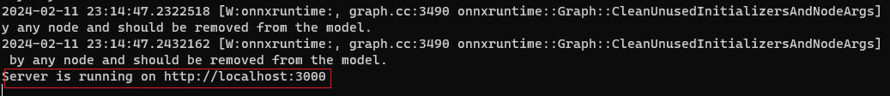
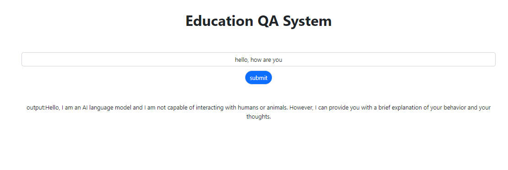

### how to start

1. install node.js & npm

   Be [here](https://nodejs.org/en/download/current) to visit the official website to install the latest version

2. clone code and install the dependencies

   `https://github.com/Harmenlv/ITS_v1.git`

   `cd ITS_v1`

   `npm i @xenova/transformers`

   `npm install express cors`

   `npm install http-server`

3. run

   `node ./server.mjs`

   `http-server -a localhost`

   then click the link to enter the webpage(http://localhost:8080), no need to enter http://localhost:3000 

   **please note we need two terminal to run `node ./server.mjs` and `http-server -a localhost` in the same time, and for `node ./server.mjs` will need near 2 minutes to load the model, we can start to input untill the terminal shows 'Server is running on http://localhost:3000', just as the following image:**

   

   

### outcome

